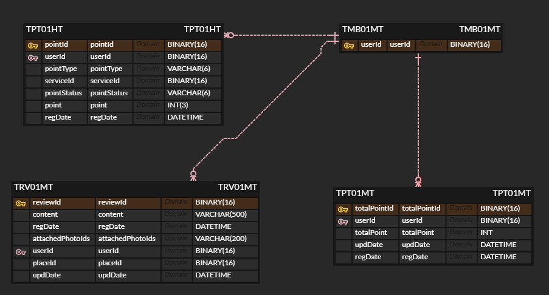

<a name="top">

# MileageService

</a>

## 목차

#### [1. 프로젝트 설명](#about_project)
#### [2. MileageService 기능](#functions)
#### [3. 아키텍처](#architecture)
#### [4. ERD](#erd)
#### [5. 실행방법](#build)

 

<a name="about_project">  

### 1. 프로젝트 설명

</a>

##### 1-1. 프로젝트 기획

> 트래픽을 고려한 마일리지 서비스

[맨 위로 가기](#top)
 

<a name="functions">  

### 2. MileageService 기능

</a>

- 리뷰작성을 통한 포인트부여
- 리뷰수정을 통한 포인트차감/증가
- 리뷰삭제를 통한 포인트차감
- 회원의 누적포인트 조회

  [맨 위로 가기](#top)
   

<a name="architecture">  

### 3. 아키텍처

</a>

트랙픽을 고려한 아키텍쳐 설계를 하였으나 
일정이 부족해 기본형태의 하나의 Module로 개발진행
#### [architecture](img/architecture.png)

**기술 스택**
* Java 11
* Junit 5
* Spring Boot 2.6.x
* AWS MySql RDS
* MySQL

[맨 위로 가기](#top)
 

<a name="erd">

### 4. ERD

</a>

#### [schema](src/test/resources/schema.sql)
#### [index](src/test/resources/data.sql)

 

[맨 위로 가기](#top)
 

<a name="build">

### 5. 실행방법

</a>

**Gradle project**
Gradle build 후 실행

[맨 위로 가기](#top)
 